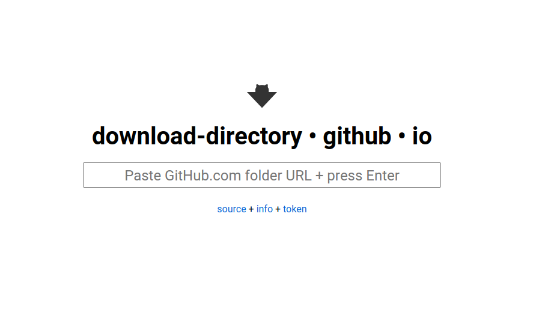
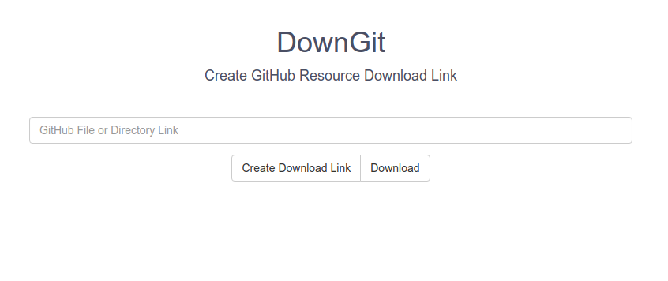

<h1> Cursos roverty </h1>

## Herramientas útiles

Herramientas para descargar parte de un repositorio de Github

* [download-directory • github • io](https://download-directory.github.io/)

  

* [DownGit](https://downgit.github.io/#/home)
  

